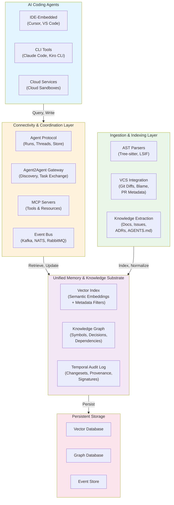
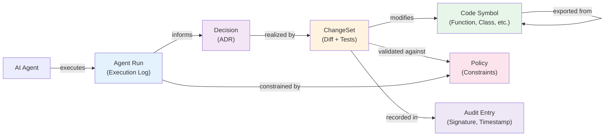
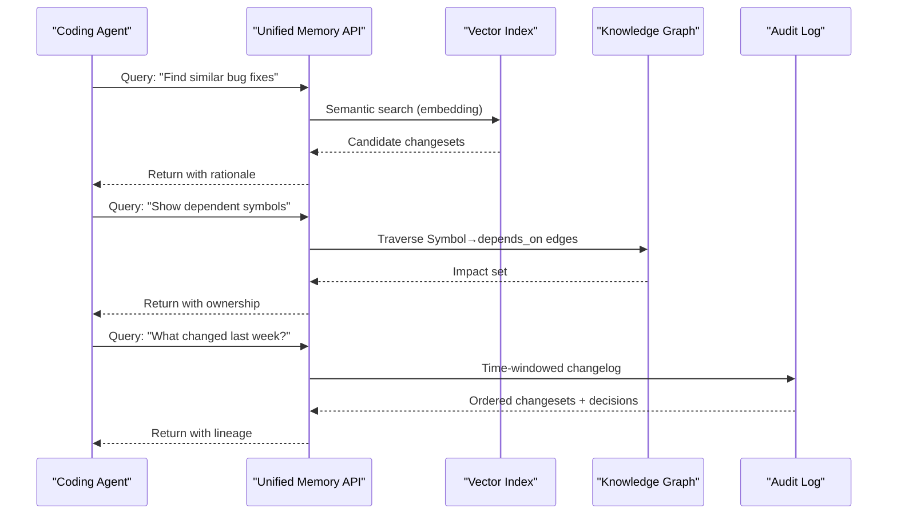
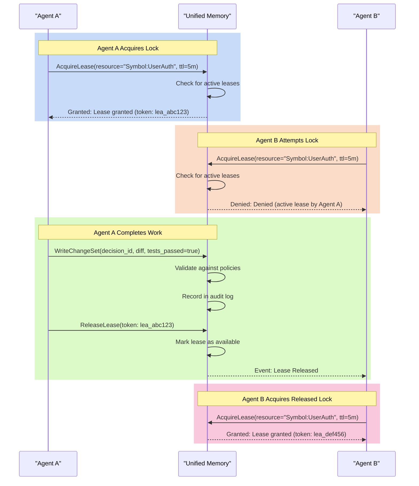
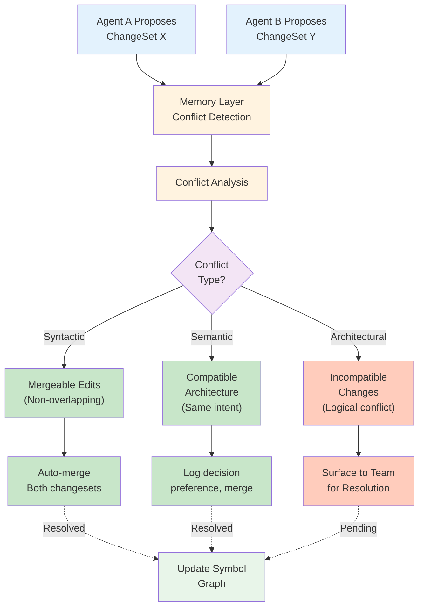
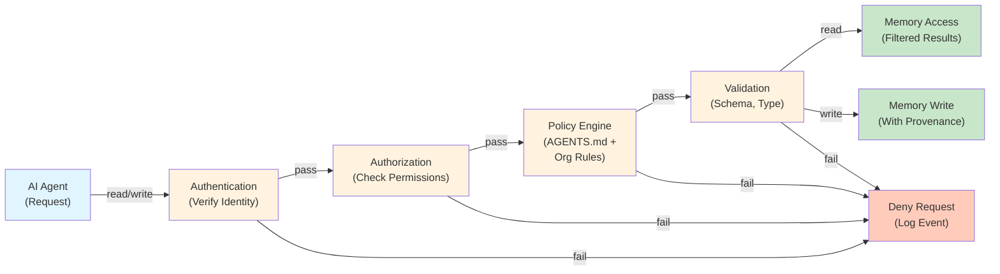
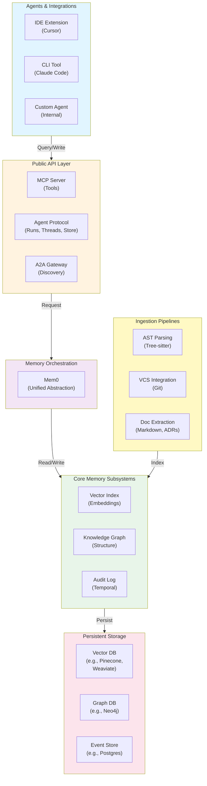

# Unified Agentic Memory Layer for AI Coding Agents

**Enterprise AI Development Infrastructure & Research-Grade Agent Framework**

Version 2.0 | January 2026

---

## Executive Summary

Modern AI coding agents—including Cursor, Claude Code, Codex, Kiro, and emerging IDE/CLI/cloud-based platforms—demonstrate remarkable individual capabilities but face a critical architectural limitation: they operate in isolation without persistent, shared knowledge of project context, architectural decisions, or coordination state across sessions and parallel workstreams.

This paper presents a vendor-agnostic **unified agentic memory layer** designed to provide persistent code intelligence, structured decision logs, and interoperable connectivity. By implementing this layer, any coding agent can immediately leverage the accumulated knowledge and decisions of previous agent executions while maintaining enterprise-grade auditability and governance.

The proposed architecture is intentionally protocol-centric, treating agents as interchangeable clients and standardizing on open interoperability primitives—including Agent2Agent (A2A), Model Context Protocol (MCP), and the LangChain Agent Protocol—to maximize ecosystem compatibility and facilitate enterprise adoption.

---

## 1. Problem Statement

AI coding assistants remain fragmented and frequently stateless across project lifecycles. This fragmentation creates several critical challenges:

- **Knowledge Silos**: Without a shared memory substrate, parallel or sequential agents duplicate work, introduce contradictory changes, and lose the rationale behind architectural decisions.
- **Coordination Failures**: Agents cannot safely coordinate parallel efforts without explicit conflict detection and resolution mechanisms.
- **Governance Gaps**: Enterprises lack consistent controls over agent-driven changes, including attribution, audit trails, and policy enforcement.
- **Context Loss**: Each agent session begins without awareness of previous decisions, rejected alternatives, or documented trade-offs.

### 1.1 Design Goals

**G1. Universal Agent Integration**  
Any agent—whether IDE-embedded, CLI-based, or cloud-deployed—can read project context and write decisions and changes through standardized interfaces.

**G2. Hybrid Retrieval Semantics**  
Support semantic recall via vector similarity, structured reasoning through knowledge graphs, and temporal queries with complete audit trails, enabling agents to understand "what was done," "why it was done," and "when it was done."

**G3. Safe Multi-Agent Coordination**  
Provide primitives for mutual exclusion, leases, task claims, and conflict detection to enable parallel agent execution without race conditions or architectural drift.

**G4. Enterprise-Grade Security & Governance**  
Implement authentication (authn), authorization (authz), multi-tenancy, encryption, and policy enforcement to meet enterprise compliance requirements and preserve auditability.

**G5. Research-Grade Observability**  
Enable reproducible agent runs, reasoning summaries, dataset export, and evaluation hooks to support continuous improvement and systematic evaluation of agent behavior.

---

## 2. Reference Architecture

The unified agentic memory platform consists of three interdependent planes: **(A) Ingestion & Indexing**, **(B) Memory & Knowledge**, and **(C) Connectivity & Coordination**. This separation of concerns enables modular scaling and independent technology choices within each plane.

### 2.1 Architectural Overview

### 2.2 System Plane Descriptions

**Ingestion & Indexing Plane**: Consumes source code (via AST parsers), version control events (diffs, blame, pull requests), and documentation artifacts (ADRs, AGENTS.md, issue trackers) and transforms them into normalized, indexed representations for the memory substrate.

**Memory & Knowledge Plane**: Maintains three complementary indices: (1) a vector database for semantic similarity queries, (2) a knowledge graph for structural and dependency reasoning, and (3) a temporal audit log for compliance and reproducibility.

**Connectivity & Coordination Plane**: Exposes standardized agent-facing APIs (Agent Protocol, MCP, A2A) and coordinates multi-agent execution through event streams, mutual exclusion primitives, and conflict detection.

---

## 3. Agent Connectivity: Protocols and Adapters

Enterprise environments require flexibility across multiple agent platforms and IDE ecosystems. Rather than betting on a single vendor solution, the platform implements a protocol-first approach with multiple interoperability standards, each optimized for specific use cases.

### 3.1 Agent-Native Interoperability Standards

**Agent2Agent (A2A)**  
An open protocol enabling agents on different stacks to discover capabilities via standardized agent cards (`.well-known/agent.json`), exchange tasks, and stream updates. A2A is built on familiar web standards (JSON-RPC, Server-Sent Events) and is specifically designed for cross-platform, multi-agent collaboration and capability negotiation.

**Model Context Protocol (MCP)**  
An open standard for secure, bidirectional connections between AI tools and external data sources or tools. For unified memory, MCP is ideal for exposing standardized "memory tools" (store, search, retrieve, write-decision) in a way that any MCP-capable agent can consume without platform-specific integrations.

**LangChain Agent Protocol**  
A production-grade API contract centered on three core abstractions: Runs (agent executions), Threads (conversation contexts), and Store (long-term memory). This protocol is a strong choice when you require framework-agnostic agent serving and a standardized API for memory lifecycle management.

**AGENTS.md Standard**  
A simple, convention-based format for embedding agent guidance directly in repositories. Treat AGENTS.md as a first-class ingestion target and propagate its policies into the memory layer, ensuring consistent project instructions across all connected agents.

### 3.2 Conventional Protocol Surfaces

For internal system communication and cases where specialized semantics are not required:

- **HTTP/REST**: Lowest friction for integration; universally supported; excellent for debugging.
- **gRPC**: Typed, efficient RPC; multi-language support; preferred for high-throughput paths.
- **WebSockets/SSE**: Streaming responses and bidirectional updates; essential for real-time coordination.
- **Message Bus (Kafka, NATS, RabbitMQ)**: Pub/sub event distribution; decoupled producer/consumer patterns; foundational for audit logging and multi-agent notification.

### 3.3 Protocol Comparison Matrix

| Protocol | Best For | Key Strengths | Primary Gaps |
|---|---|---|---|
| **A2A** | Cross-agent collaboration | Discoverable capabilities; structured task lifecycle; streaming updates | Emerging ecosystem; complex authz requirements |
| **MCP** | Standardized memory tools | Tool schema uniformity; secure 2-way connections; strong adoption momentum | Not a complete task workflow protocol |
| **Agent Protocol** | Agent serving + stores | Clear production contract; integrated long-term store; framework-agnostic | Does not define tool ecosystem |
| **HTTP/REST** | Universal integration | Universal support; simplicity; debuggability | Requires schema definition; no built-in semantics |
| **gRPC** | High-throughput RPC | Type safety; efficiency; polyglot support | Debugging complexity; code generation required |
| **Event Bus** | Coordination, observability | Decoupling; scalability; event replay; audit-native | Operational overhead; consistency complexity |

---

## 4. Unified Memory: Core Data Model

A meaningful unified memory layer transcends simple code embeddings. It must capture intent, decisions, provenance, and coordination state so that multiple agents can safely build upon each other's work with full contextual understanding.

### 4.1 Memory Objects (Canonical Model)

**Symbol Memory**  
Represents code structure: files, modules, functions, classes, and their relationships (calls, imports, dependencies). Each symbol is associated with ownership metadata, last modified timestamp, and content hash for change detection.

**Decision Memory**  
Captures architectural and technical decisions in an Architecture Decision Record (ADR) format: problem statement, considered options, rationale for selection, documented trade-offs, and the chosen path. Linked to the changesets that implement the decision.

**ChangeSets**  
Groups related code differences with metadata: the git diff, associated tests executed, CI/CD results, pull request links, associated decision ID, and rollback capability. Enables agents to reason about cohesive units of work rather than individual file changes.

**Agent Runs**  
Records each agent execution: input prompt (or summarized variant), tools invoked, context IDs retrieved, reasoning steps, output artifacts, and confidence scores. Supports evaluation, reproducibility, and feedback loops.

**Policies**  
Aggregates from AGENTS.md, organizational security policies, and compliance constraints. Evaluated at retrieval time to filter sensitive information and enforce guardrails on agent actions.

**Coordination Artifacts**  
Primitives for safe parallel execution: locks/leases (mutual exclusion), task claims (work ownership), execution plans (DAGs of work items), checkpoints (savepoints for resumption), and conflict records (detected incompatibilities with resolution suggestions).

### 4.2 Memory Object Relationships

### 4.3 Hybrid Retrieval Strategy

The memory layer employs three complementary retrieval modes:

**Vector Retrieval** ("Semantic Similarity")  
Queries embeddings to find conceptually related code patterns, past solutions to similar problems, and relevant documentation. Example: "Find previous bug fixes related to authentication."

**Graph Traversal** ("Structural Reasoning")  
Navigates the knowledge graph to identify all symbols impacted by a change, trace dependency chains, and understand architectural relationships. Example: "Show all functions that depend on this module."

**Temporal Queries** ("Audit & Reproducibility")  
Retrieves changes in temporal order, links to decisions that motivated them, and enables time-windowed analysis. Example: "What changed since the last release and why?"

---

## 5. Memory Frameworks and System Integration

While memory primitives can be implemented from first principles, established frameworks accelerate correctness, reduce integration complexity, and provide production-tested patterns. The recommended architecture defines a stable internal memory API with pluggable backends.

### 5.1 Mem0: Recommended Core Memory Abstraction

**Mem0** is a purpose-built long-term memory framework for agentic systems. Research benchmarks demonstrate substantially lower p95 latency and significant token savings compared to naive "context stuffing" approaches, while improving coherence in long-running dialogs.

**Key Advantages**:
- **Compression**: Distills conversation history into structured memories, reducing token overhead.
- **Scalability**: Maintains performance across extended agent lifespans (hundreds of interactions).
- **Recall Accuracy**: Hybrid retrieval (semantic + structured) yields higher-quality context.
- **Plug-in Backends**: Agnostic to storage implementation (PostgreSQL, vector DBs, graph DBs).

Mem0 functions as the memory orchestration layer, sitting above your vector and graph stores and providing unified access semantics.

### 5.2 Orchestration Framework Options

**LangGraph / LangChain**  
Production-ready graph-based orchestration with strong persistence primitives. Ideal for complex multi-agent workflows with decision branching and state management. Excellent documentation and community ecosystem.

**AutoGen (Microsoft)**  
Flexible multi-agent conversation framework with role-based collaboration patterns. Strong support for agent-to-agent communication and dynamic team composition. Well-suited for exploratory agent research.

**CrewAI**  
Lightweight framework emphasizing "crew" (team) abstractions with clear role definitions and task hierarchies. Easier onboarding for teams new to multi-agent systems. Growing adoption in enterprise settings.

**Pydantic-AI**  
Focuses on robust structured outputs and type-safe tool schemas. Excellent for deterministic memory writes and schema validation. Minimal overhead; preferred for performance-critical paths.

---

## 6. Multi-Agent Coordination at Scale

Parallel agent execution introduces complexity: without explicit coordination, agents duplicate work, conflict on shared resources, or converge on contradictory architectural decisions. The unified memory layer must provide soft coordination primitives backed by the knowledge graph.

### 6.1 Coordination Models and Patterns

**Pull Model** ("Query-When-Needed")  
Agents proactively query the memory layer for context before acting. Low operational overhead; high autonomy for agents. Risk: decisions made in information gaps.

**Push Model** ("Immediate Commitment")  
Agents immediately write decisions and changes to memory with strong transactional guarantees. High auditability; potential bottleneck for rapid iteration.

**Pub/Sub Model** ("Event-Driven Coordination")  
Agents subscribe to events ("Symbol X was modified," "Lock released on module Y," "Critical policy violation detected") and react asynchronously. Scalable for large teams; preferred for continuous deployment scenarios.

**Recommended Hybrid Approach**: Combine pull (lightweight queries) with push (decision commits) and selective pub/sub (for high-impact events) to balance autonomy, auditability, and operational simplicity.

### 6.2 Lock/Lease Workflow

### 6.3 Conflict Detection & Resolution

When multiple agents attempt concurrent changes to the same symbol, the memory layer detects the conflict and surfaces it for resolution:

---

## 7. Enterprise Controls: Security, Governance, and Compliance

Enterprise environments demand memory systems be secure by default. Implement comprehensive authentication, authorization, multi-tenancy, encryption, and policy enforcement at all ingress and egress points.

### 7.1 Authentication & Authorization

**Authentication** ("Who is accessing?")  
Integrate with enterprise identity providers via OIDC (OpenID Connect) or SAML 2.0. Support service-to-service authentication via mTLS or JWT tokens with cryptographic verification. Every API request must carry provable identity.

**Authorization** ("What can they access?")  
Implement role-based access control (RBAC) for coarse-grained permissions (e.g., "Developer role can read all symbols, write changes only to assigned features"). Supplement with attribute-based access control (ABAC) for fine-grained rules (e.g., "Cannot modify symbols outside of feature branch X unless approved by architect").

### 7.2 Provenance and Audit Trails

Every write operation must include:

- **Agent Identity**: Which agent performed the action (with version and configuration).
- **Model Version**: Which language model or version was used for reasoning.
- **Tool Calls**: Summarized tools invoked (to avoid bloating audit logs while preserving accountability).
- **Retrieved Context IDs**: Which memory objects were used to inform the decision.
- **Cryptographic Signature**: Cryptographic proof that the entry has not been tampered with.
- **Human Approvals** (if required): Evidence of human review or approval for sensitive changes.

This creates a tamper-evident, reproducible audit trail suitable for compliance reporting and forensic analysis.

### 7.3 Encryption

- **In Transit**: TLS 1.3 for all client-server and server-server communication.
- **At Rest**: AES-256-GCM encryption for sensitive data in database storage; encrypted backups.
- **Key Management**: Centralized key management service (AWS KMS, HashiCorp Vault, Azure Key Vault) with key rotation policies and access logging.

### 7.4 Multi-Tenancy

Ensure strict isolation between customer/project data:

- **Data Isolation**: Separate database schemas or row-level security (RLS) policies per tenant.
- **Query Isolation**: Automatic tenant ID injection in all queries; defense-in-depth validation.
- **Event Bus Isolation**: Separate topics/channels per tenant in message brokers to prevent information leakage.

### 7.5 Policy Enforcement Layer

---

## 8. Implementation Roadmap

The following phased approach balances early value delivery with sustainable architecture.

### Phase 0: Specification & Data Model Definition
- **Duration**: 2-3 weeks
- **Deliverables**: Canonical object model (Symbols, Decisions, ChangeSets, Runs, Policies) in OpenAPI/JSON Schema format. Define versioning strategy.
- **Success Criteria**: Stakeholder alignment on data model; clear examples of how each object type solves real agent coordination problems.

### Phase 1: Ingestion & Baseline Indexing
- **Duration**: 4-6 weeks
- **Deliverables**: Tree-sitter or LSIF-based AST parsing; git integration for diffs and blame; embeddings pipeline (chunking, model selection, vector DB setup).
- **Success Criteria**: Ability to index a 100k-line codebase in <5 minutes; semantic search functional for code snippets and documentation.

### Phase 2: Agent Protocol & MCP Exposure
- **Duration**: 4-6 weeks
- **Deliverables**: Agent Protocol implementation (runs, threads, store endpoints); MCP server exposing memory tools (search, store, retrieve, write-decision).
- **Success Criteria**: At least two independent agent implementations successfully integrate via MCP; documented API contract.

### Phase 3: Knowledge Graph & Temporal Queries
- **Duration**: 6-8 weeks
- **Deliverables**: Symbol graph construction (files, functions, classes, dependencies); decision-to-changeset linking; temporal audit log with time-windowed queries.
- **Success Criteria**: Graph traversal queries complete in <500ms; audit replay enables deterministic reproduction of agent decisions.

### Phase 4: Coordination Primitives & Conflict Resolution
- **Duration**: 4-6 weeks
- **Deliverables**: Lease/lock manager with TTL and deadlock detection; conflict detection algorithm; pub/sub event bus integration.
- **Success Criteria**: Parallel agents (2-4 concurrent) can execute without data corruption; conflicts detected and surfaced for resolution within 1 second.

### Phase 5: Enterprise Controls & Observability
- **Duration**: 6-8 weeks
- **Deliverables**: OIDC/SAML authentication; RBAC/ABAC authorization; encryption at rest and in transit; observability dashboards (agent activity, memory hit rates, conflict frequency).
- **Success Criteria**: Full audit trail captured for compliance; role-based access controls tested across multiple identities; performance metrics track p95 latency, throughput, and error rates.

---

## 9. Best-Overall Approach: Scaled Recommendation

For organizations seeking the optimal balance between ecosystem compatibility and enterprise reliability, the following architecture is recommended:

### Core Design Principles

1. **Protocol-First Architecture**: Define stable APIs in Agent Protocol, MCP, and A2A standards rather than proprietary formats. This maximizes agent portability and future-proofs against vendor churn.

2. **Three Public Surfaces**:
   - **MCP Server**: Exposes standardized memory tools (search, store, retrieve) so any MCP-capable agent immediately gains memory access.
   - **Agent Protocol Endpoints**: Provides runs, threads, and store lifecycle management with clear contracts for agent framework integration.
   - **A2A Gateway** (Optional): Enables agent-to-agent discovery, capability negotiation, and task delegation for advanced coordination scenarios.

3. **Hybrid Storage Backend**: Combine vector indices (semantic retrieval) and knowledge graphs (structural reasoning) backed by temporal audit logs (compliance and reproducibility).

4. **Mem0 Orchestration**: Layer Mem0 on top of vector and graph stores to provide unified memory semantics, compression, and recall optimization.

5. **Declarative Policies**: Embed security and coordination rules in AGENTS.md files and centralized policy documents, evaluated at query and write time via a policy engine.

### High-Level Architecture Diagram

### Implementation Checklist

**Immediately** (Weeks 1-2):
- [ ] Finalize canonical data model and obtain stakeholder sign-off.
- [ ] Select vector database (Pinecone, Weaviate, Qdrant) and graph database (Neo4j, ArangoDB).
- [ ] Design schema for Mem0 integration.

**Near-term** (Weeks 3-6):
- [ ] Implement Phase 0-1 (specification and ingestion).
- [ ] Stand up MCP server with mock endpoints.
- [ ] Develop proof-of-concept integration with one agent platform.

**Medium-term** (Weeks 7-12):
- [ ] Complete Phase 2-3 (Agent Protocol, knowledge graph).
- [ ] Conduct performance benchmarks; optimize slow paths.
- [ ] Document API contracts and agent integration guide.

**Long-term** (Weeks 13-20):
- [ ] Implement Phase 4-5 (coordination, enterprise controls).
- [ ] Run pilot with internal teams; gather feedback.
- [ ] Productionize; prepare for external agent ecosystem.

---

## 10. Conclusion

The unified agentic memory layer represents a critical missing piece in multi-agent AI development infrastructure. By standardizing on open protocols (Agent Protocol, MCP, A2A), maintaining comprehensive audit trails, and providing safe coordination primitives, organizations can unlock significant value: reduced agent hallucination, faster onboarding of new agents into projects, compliant and auditable development practices, and a foundation for continuous improvement through systematic evaluation.

The proposed architecture is designed for incremental adoption, allowing organizations to begin with Phase 0-1 (ingestion and search) and gradually layer in complexity (knowledge graphs, coordination, enterprise controls) as needs demand and team expertise grows.

---

## References

- **Agent2Agent (A2A) Announcement** – Google Developers Blog  
  https://developers.googleblog.com/en/a2a-a-new-era-of-agent-interoperability/

- **Agent2Agent Codelab** – Google Codelabs  
  https://codelabs.developers.google.com/intro-a2a-purchasing-concierge

- **Model Context Protocol Announcement** – Anthropic  
  https://www.anthropic.com/news/model-context-protocol

- **Model Context Protocol Specification** – modelcontextprotocol.io  
  https://modelcontextprotocol.io/specification/2025-11-25

- **LangChain Agent Protocol** – LangChain GitHub  
  https://github.com/langchain-ai/agent-protocol

- **Mem0: A Long-Term Memory Framework for Agents** – arXiv  
  https://arxiv.org/abs/2504.19413

- **OpenAI Codex Introduction** – OpenAI  
  https://openai.com/index/introducing-codex/

- **Codex CLI Documentation** – OpenAI Developers  
  https://developers.openai.com/codex/cli/

- **AGENTS.md Standard** – agents.md  
  https://agents.md/

- **Cursor Codebase Indexing Documentation** – Cursor  
  https://cursor.com/docs/context/codebase-indexing

- **Kiro Autonomous Agent Introduction** – Kiro  
  https://kiro.dev/blog/introducing-kiro-autonomous-agent/

- **Anthropic Donation of MCP and AAIF Establishment** – Anthropic  
  https://www.anthropic.com/news/donating-the-model-context-protocol-and-establishing-of-the-agentic-ai-foundation

---

**Document Version**: 2.0  
**Last Updated**: January 2026  
**Status**: Final  
**Audience**: Enterprise architects, AI platform engineers, research teams
