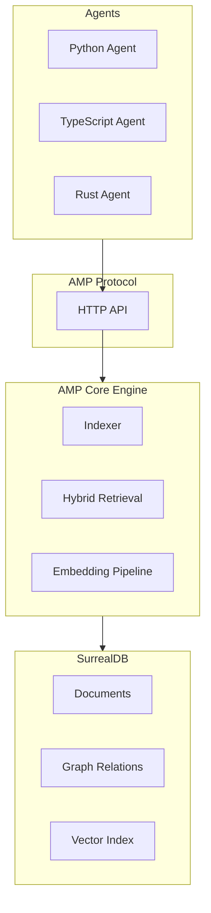
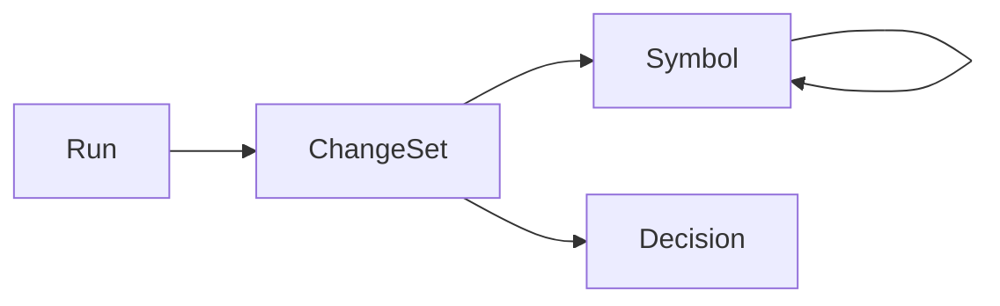
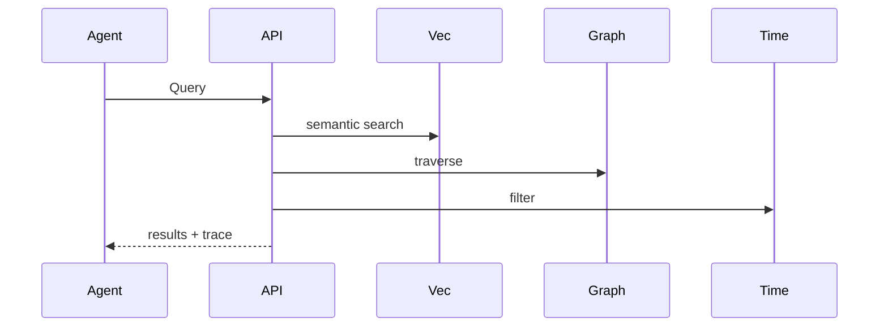
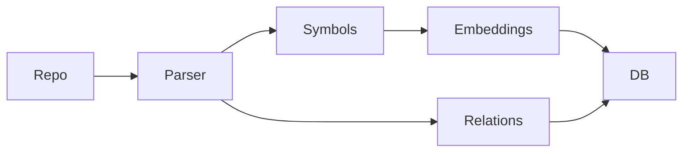

# Agent Memory Protocol (AMP)

**A Vendor-Neutral Protocol for Durable, Unified Memory in Agentic Software Development**

Version: Draft v1 (Hackathon Edition)

---

## 1. Executive Summary

Modern coding agents (Cursor, Claude Code, Codex, custom CLI agents, automation pipelines) operate in isolation. They lack durable, shared memory of:

- What the codebase structurally contains
- What decisions were made and why
- What changed over time
- What context should guide future actions

**Agent Memory Protocol (AMP)** defines a language-neutral contract that allows any agent to persist, retrieve, and reason over structured project memory using a unified memory substrate.

AMP is:

- **Protocol-first** – schemas + APIs define the contract
- **Storage-agnostic** – any backend may implement it (reference implementation uses SurrealDB)
- **Language-neutral** – Rust server, Python + TypeScript clients
- **Local-first** – hackathon-ready single binary
- **Extensible** – coordination, governance, and enterprise layers evolve later

---

## 2. Core Goals

### G1 – Unified Project State
Agents must share a consistent understanding of the project’s structure, history, and intent.

### G2 – Hybrid Memory Retrieval
Memory must support:

- Semantic similarity (vector)
- Structural reasoning (graph)
- Temporal lineage (audit)

### G3 – Protocol Portability
AMP must be usable from any language or agent framework via HTTP + JSON.

### G4 – Deterministic Traceability
Every retrieval must explain why the memory was returned and where it originated.

### G5 – Hackathon Viability
AMP v1 must be buildable in ~7 days with a compelling demo.

---

## 3. Non-Goals (v1)

- Distributed clustering
- Full RBAC / enterprise auth
- IDE UI
- MCP adapters
- Complex workflow orchestration
- Advanced conflict resolution

---

## 4. High-Level Architecture



---

## 5. Canonical Memory Objects

All objects share base fields:

```json
{
  "id": "string",
  "type": "symbol | decision | changeset | run",
  "tenant_id": "string",
  "project_id": "string",
  "created_at": "timestamp",
  "updated_at": "timestamp",
  "provenance": {
    "agent": "string",
    "model": "string",
    "tools": ["string"],
    "summary": "string"
  },
  "links": [
    { "type": "string", "target": "object_id" }
  ],
  "embedding": [number]
}
```

### 5.1 Symbol
Represents code structure.

Fields:
- name
- kind (file, module, class, function)
- path
- language
- content_hash

Relations:
- depends_on
- defined_in
- calls

### 5.2 Decision
Architecture or technical decisions.

Fields:
- title
- problem
- options
- rationale
- outcome

Relations:
- justified_by → changeset

### 5.3 ChangeSet
Cohesive unit of change.

Fields:
- diff
- files_changed
- tests
- status

Relations:
- modifies → symbol
- implements → decision

### 5.4 Run
Agent execution record.

Fields:
- input_summary
- outputs
- errors
- confidence

Relations:
- produced → changeset

---

## 6. Object Relationships



---

## 7. Hybrid Retrieval

AMP exposes a single query endpoint that merges:

- Vector similarity
- Graph traversal
- Temporal filters



---

## 8. Indexing Pipeline



---

## 9. AMP API (v1)

### Write
- POST /v1/objects
- POST /v1/objects:batch

### Read
- GET /v1/objects/{id}
- POST /v1/query
- GET /v1/trace/{id}

### Coordination (optional v1-lite)
- POST /v1/leases:acquire
- POST /v1/leases:release

---

## 10. Client SDKs

Generated from OpenAPI:

- Python SDK
- TypeScript SDK

Exposed functions:

- store(obj)
- query(params)
- trace(id)

---

## 11. Reference Implementation

### Runtime

- Rust
- Axum
- Tokio
- SurrealDB (embedded)

### Structure

```
amp/
 ├─ spec/
 ├─ server/
 ├─ sdks/
 ├─ examples/
```

---

## 12. Hackathon Roadmap (7 Days)

### Day 1 – Project Setup
- Rust workspace
- SurrealDB embedded
- Axum skeleton

### Day 2 – Schemas + Storage
- Object schemas
- CRUD endpoints

### Day 3 – Indexer
- Repo scanner
- Symbol graph

### Day 4 – Embeddings + Vector Search
- Embedding generation
- Similarity queries

### Day 5 – Hybrid Query
- Merge vector + graph + temporal
- Trace output

### Day 6 – SDKs + Demo
- Generate Python SDK
- Generate TS SDK
- CLI demo

### Day 7 – Polish
- README
- Demo script
- Diagrams

---

## 13. Demo Scenario

1. Index a repo
2. Run an agent
3. Store run + changeset
4. Query memory
5. Show trace

---

## 14. Future Extensions

- MCP adapters
- Distributed scaling
- UI via Tauri + React
- Governance
- Advanced coordination

---

## 15. Conclusion

AMP establishes a durable memory substrate for agentic software development. Even as a hackathon prototype, it demonstrates real protocol viability, strong architectural grounding, and a clear growth path.