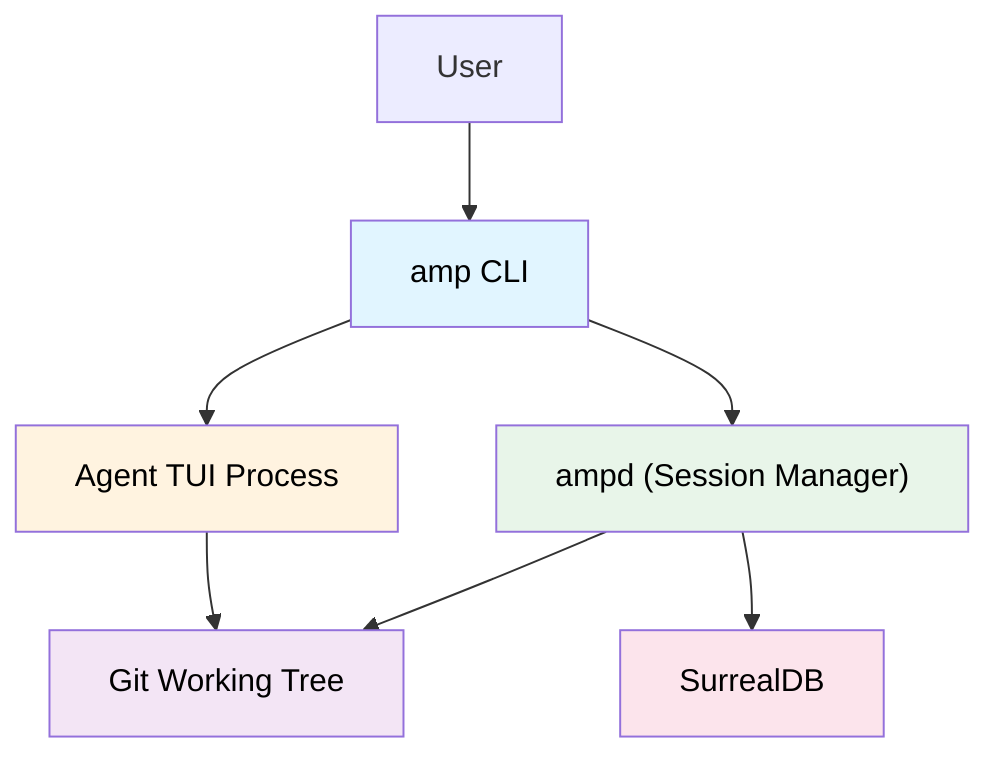
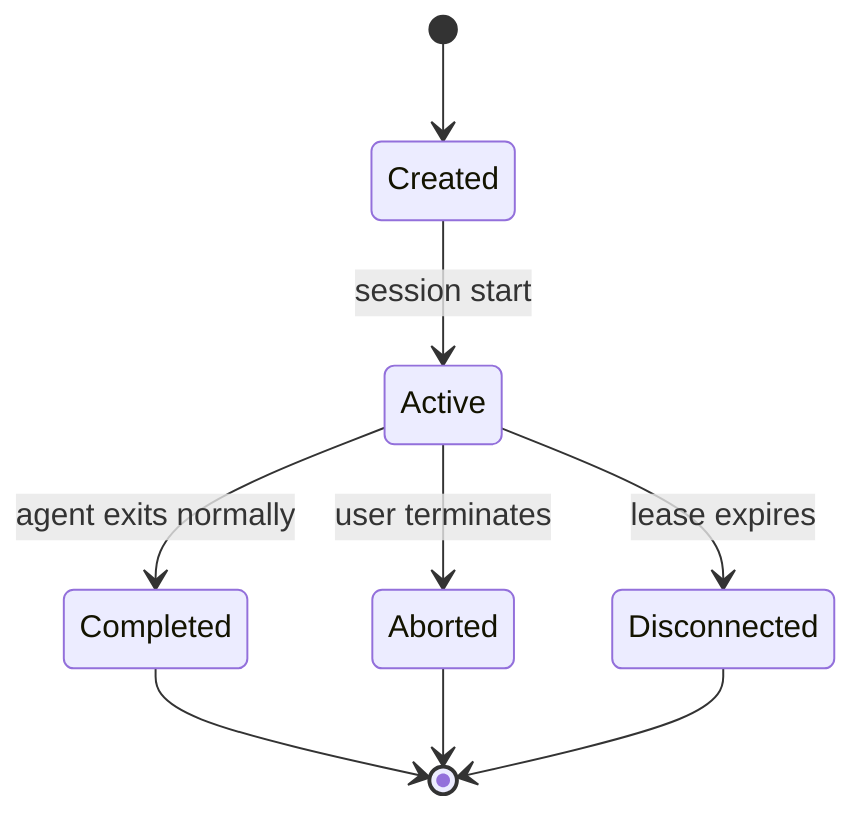
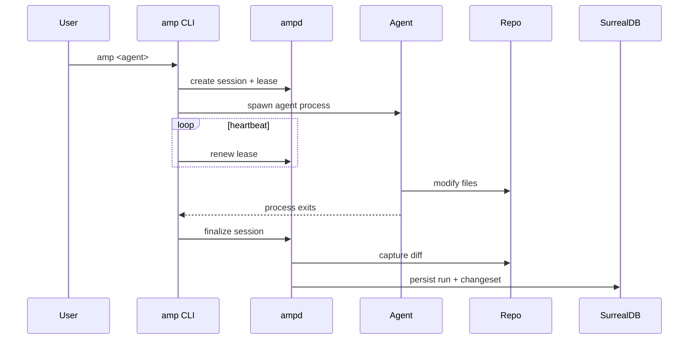

# AMP Session Lifecycle & Agent Attachment

**Feature Spec (High-Level)**  
Version: Draft v1

---

## 1. Overview

AMP Sessions provide a durable, traceable execution boundary for interactive coding agents, including terminal-based TUIs (Claude Code, Kiro CLI, Codex CLI, custom agents).

A session represents:

- One continuous agent interaction window
- The lifecycle of a single unit of work
- The boundary for capturing:
  - inputs (context bundles, task intent)
  - outputs (code changes, artifacts)
  - provenance (timestamps, status, lineage)

Sessions enable AMP to reliably trace agent activity even when agents do not natively support protocol hooks or tool calling.

---

## 2. Problem Statement

Most coding agents run as:

- Long-lived terminal applications
- Interactive TUIs
- Processes that cannot be easily wrapped or instrumented
- Tools without native plugin or callback APIs

Traditional wrapper approaches (`amp wrap -- <cmd>`) are insufficient for these environments.

AMP must:

1. Attach to interactive agent lifecycles reliably
2. Detect session termination even during crashes or disconnects
3. Capture meaningful outputs without invasive instrumentation
4. Preserve user-native workflows

---

## 3. Design Goals

### G1 – Transparent UX
Users should be able to run agents naturally without learning complex wrappers.

### G2 – Deterministic Session Closure
Sessions MUST reliably terminate when the agent exits or disconnects.

### G3 – Non-Invasive Integration
AMP must not modify or interfere with agent internals or terminal rendering.

### G4 – Durable Provenance
Every session produces a persistent Run record with traceable lineage.

### G5 – Resilience
Unexpected crashes, terminal disconnects, or forced kills must still finalize sessions safely.

---

## 4. High-Level Architecture



AMP CLI launches or attaches to the agent while ampd manages session state, leases, telemetry capture, and persistence.

---

## 5. Session Model

### 5.1 Session Definition

A Session represents one contiguous interaction with an agent.

Fields (conceptual):

- `session_id`
- `run_id`
- `project_id`
- `started_at`
- `ended_at`
- `status`
  - `active`
  - `completed`
  - `aborted`
  - `disconnected`
- `agent_command`
- `environment_snapshot`
- `lease_id`

---

### 5.2 Lease Model

Each session owns a renewable lease:

- `lease_id`
- `owner_pid`
- `host`
- `ttl`
- `last_heartbeat`

If heartbeats stop and TTL expires, the session is automatically finalized.

---

## 6. Session Lifecycle



---

## 7. Normal Execution Flow



---

## 8. Failure Handling

### 8.1 Agent Crash
- Agent exits unexpectedly
- AMP detects process termination
- Session finalized with status = `aborted`

### 8.2 Terminal Disconnect / Kill -9
- Wrapper process terminates abruptly
- Lease heartbeat stops
- TTL expires
- ampd auto-finalizes session with status = `disconnected`

### 8.3 Partial Output Recovery
On forced termination:

- Best-effort diff capture
- Any staged or working changes preserved
- Session marked accordingly

---

## 9. Output Capture

At session finalization, AMP captures:

### Required
- Git diff (working tree or staged)
- Files changed
- Timestamp range
- Exit status

### Optional (if available)
- Test output logs
- User notes
- Context bundle IDs used
- Error messages

These become:

- `Run` object
- Linked `ChangeSet` object (if diff non-empty)

---

## 10. UX Patterns

### Pattern A — Transparent Launcher (Primary)

```bash
amp claude-code
```

- AMP starts session
- Spawns agent
- Auto-finalizes on exit

---

### Pattern B — Manual Attach (Fallback)

```bash
amp session start
claude-code
amp session end
```

Daemon auto-finalizes if user forgets.

---

## 11. How This Fits Into AMP

Sessions integrate directly into:

### Memory Model
- Each Session → exactly one `Run`
- Run links:
  - Context IDs retrieved
  - ChangeSet produced
  - Symbols impacted

### Hybrid Retrieval
- Queries can surface:
  - Recent runs
  - Disconnected sessions
  - High-impact changes

### Provenance
- Enables full lineage:
  ```
  Query → Run → ChangeSet → Symbols
  ```

### Agent Interoperability
- Works without agent modifications
- Compatible with TUI-based tools
- Future tool integrations can bypass wrapper and write directly

---

## 12. Future Extensions

- Live checkpoint snapshots
- Streaming telemetry capture
- Multi-agent session linking
- IDE attachment
- Distributed sessions

---

## 13. Summary

AMP Sessions provide the backbone for reliable agent integration in real-world environments where agents operate as interactive terminal applications.

They guarantee:

- Safe lifecycle management
- Durable provenance
- Automatic recovery
- Minimal user friction
- Strong compatibility

This enables AMP to function as a true system-of-record for agentic development activity.
